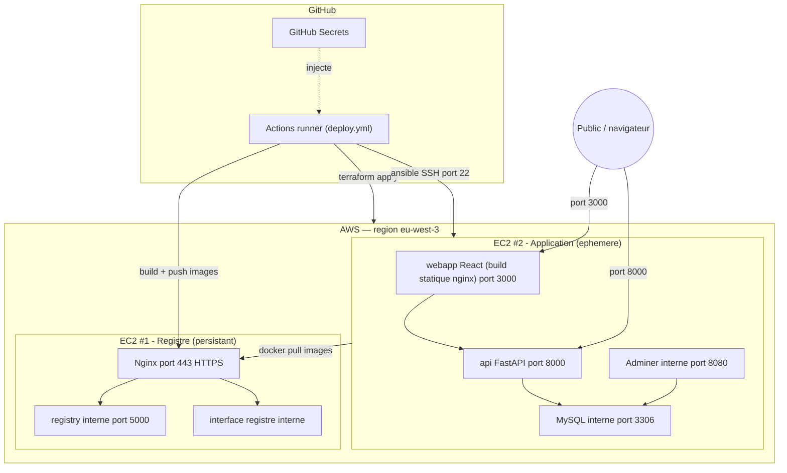

# Documentation d'architecture — Projet Final DevOps « Zero-Touch »

> **Livrable §8 du sujet** : le fichier unique présentant l'**architecture finale**
> (EC2 Registre + EC2 Applicative). Document **auto-suffisant**.
> Pour aller plus loin : récit détaillé, décisions/pièges et **matrice de conformité** dans
> [docs/COMPTE-RENDU.md](docs/COMPTE-RENDU.md) ; diagrammes UML par type dans
> [docs/architecture/](docs/architecture/).

## 1. Vue d'ensemble

Le déploiement repose sur **deux serveurs AWS** (région `eu-west-3`), aux rôles bien séparés :

| | **EC2 #1 — Registre** | **EC2 #2 — Application** |
|---|---|---|
| **Rôle** | **stocke** les images Docker | **exécute** la stack applicative |
| **Durée de vie** | **persistant** (gardé entre les déploiements) | **éphémère** (recréé à chaque run) |
| **Exposé au public** | `443` (HTTPS, via Nginx) | `3000` (Frontend) + `8000` (API) |
| **Fermé (interne)** | `5000` (registre Docker) | `8080` (Adminer) + `3306` (MySQL) |
| **Sécurité** | Nginx reverse proxy + SSL + auth bcrypt | SSH (`22`) restreint à l'IP du runner CI |

Pourquoi cette séparation ? Le **registre** contient l'historique des images : il est coûteux à
reconstruire, donc il **survit** entre les déploiements. L'**application**, elle, doit pouvoir être
**détruite et recréée à l'identique** à chaque exécution du pipeline — c'est l'« environnement
éphémère » exigé par le sujet.

## 2. Diagramme de déploiement (où tourne quoi)

**Lecture :** trait **plein** = appel réseau ; trait **pointillé** = injection de configuration.
Les ports marqués « interne » ne sont **jamais** exposés à Internet.

## 3. Le pipeline en 5 étapes (`.github/workflows/deploy.yml`)

Un seul workflow, déclenché en **un clic** (`workflow_dispatch`), enchaîne :

1. **Build & Push** — build des images Front (React) + API (FastAPI), `docker push` vers le
   registre privé (tags `SHA` + `latest`).
2. **Provision** — `terraform apply` crée l'EC2 #2 : AMI Ubuntu **dynamique**, **clé SSH générée**
   à la volée, Security Group. Le `tfstate` est local au runner → infra **jetable**.
3. **Bridge** — les *outputs* Terraform (IP publique, clé privée) deviennent `inventory.ini` +
   `key.pem` (`chmod 600`) que sait consommer Ansible.
4. **Deploy** — `ansible-playbook` installe Docker, **se logue au registre**, `docker compose pull`
   puis `up -d`. C'est la **seule** connexion SSH, et elle est automatique (« No SSH humain »).
5. **Validate** — `curl` du Front et de l'API **hors Ansible** ; le job échoue si pas de réponse,
   et affiche l'**URL d'accès**.

## 4. Réseau & exposition des ports

- **Public** : EC2 #1 → `443` ; EC2 #2 → `3000` (Front) + `8000` (API).
- **Administration** : `22` (SSH) ouvert **uniquement à l'IP du runner CI** (l'outil Ansible) —
  pas à Internet entier.
- **Jamais exposés** : registre `5000`, Adminer `8080`, MySQL `3306`.
  → conforme à « **Frontend et API publics, le reste non** » (sujet §2).

## 5. Gestion des secrets

Source **unique** : les **GitHub Secrets**. Aucun secret en clair dans le code
(`.env.sample` ne contient que des placeholders, garde-fou `gitleaks`). Cas particulier de la
**clé SSH** : elle n'existe pas au départ — Terraform la **génère**, la renvoie en *output
sensible*, le runner l'écrit en `key.pem` juste le temps d'Ansible, puis l'infra éphémère
disparaît. La clé n'est **jamais** versionnée. Détail :
[diagramme de flux des secrets](docs/architecture/diagrams/zero-touch/06-data-flow-secrets.md).
