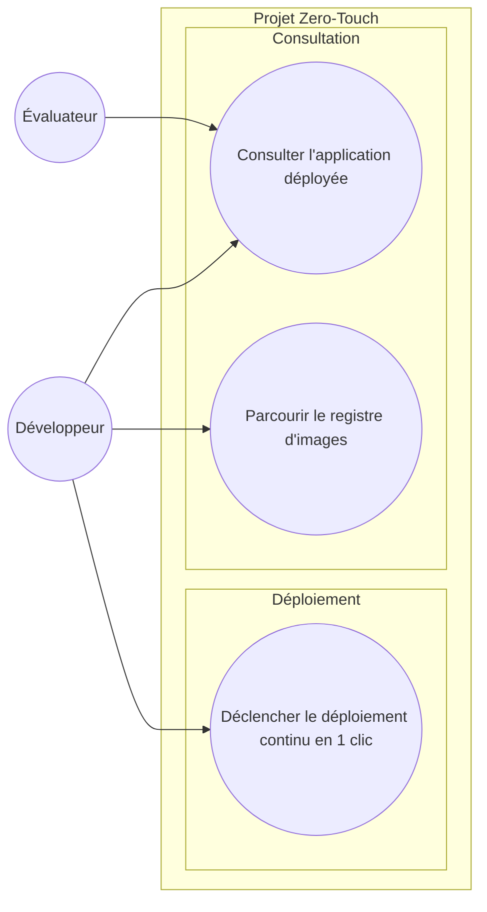

# Diagramme de cas d'utilisation — Zero-Touch — qui déclenche quoi

> **Feature** : déploiement continu « Zero-Touch » (issues #10 → #14).
> **Sujet** : §1 (mise en situation), §6 (déclenchement manuel en 1 clic).

## Context

Ce diagramme montre **les acteurs et leurs objectifs** vis-à-vis du système. Il ne décrit
**pas** le fonctionnement interne de la pipeline (build, provision, bridge…) : ces étapes
sont la **réalisation** d'un cas d'utilisation, détaillée dans le diagramme de séquence (02).

Règle UML 2.5 appliquée : un cas d'utilisation est un **objectif initié par un acteur**,
jamais un événement système. « Construire les images » ou « Provisionner l'EC2 » ne sont
donc pas des cas d'utilisation — ce sont des étapes de réalisation.

## Diagram

## Notes

- **Un seul vrai déclencheur côté objectif** : « Déclencher le déploiement continu en 1 clic »
  (acteur Développeur). Toute la complexité (5 étapes) est **derrière** ce clic — c'est l'essence
  du « Zero-Touch ».
- **L'Évaluateur** n'initie qu'une consultation : il ouvre l'URL fournie en fin de déploiement
  (livrable `rendu.txt`, issue #17).
- Les étapes Build & Push / Provision / Bridge / Deploy / Validate **n'apparaissent pas ici** :
  ce sont des actions **système** déclenchées par UC1, modélisées dans le diagramme de séquence (02).
