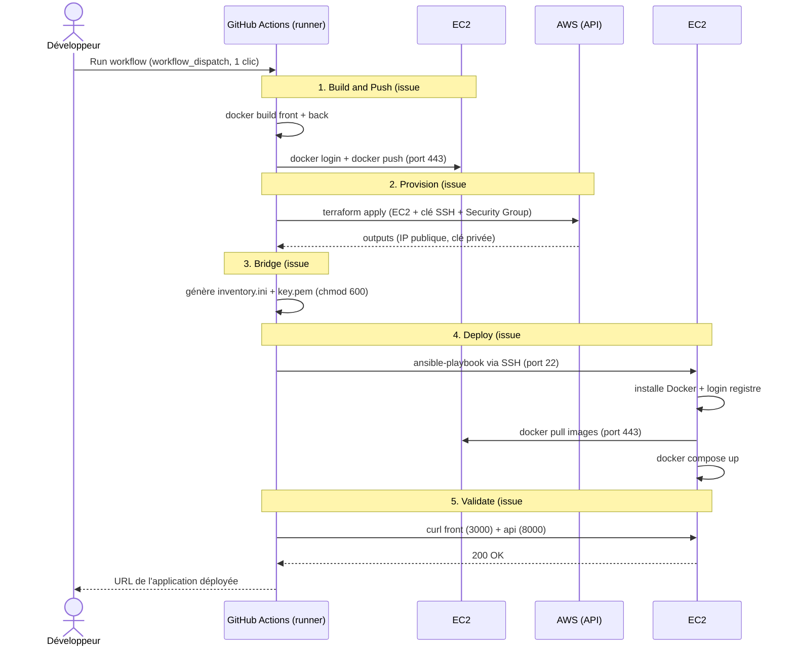

# Diagramme de séquence — Zero-Touch — la pipeline en 5 étapes

> **Feature** : pipeline d'orchestration `deploy.yml` (issues #10 → #14).
> **Sujet** : §3 Phase 3 (orchestration), §6 (attendus pipeline).

## Context

Ce diagramme montre **ce qui se passe dans le temps** quand le Développeur clique sur
« Run workflow ». C'est la **réalisation** du cas d'utilisation UC1 (cf. 01). Chaque bloc
`Note` correspond à une étape du sujet et à une issue.

## Diagram

## Notes

- **Séquentiel et sans humain** : tout s'enchaîne dans un seul job. La contrainte « No SSH
  humain » est respectée — la seule connexion SSH est celle d'**Ansible** (étape 4), pas d'un humain.
- **Le « Bridge » (étape 3)** est le point délicat : il transforme les *outputs* Terraform
  (IP, clé) en fichiers (`inventory.ini`, `key.pem`) qu'Ansible sait consommer. C'est le pont
  entre l'infra et la configuration.
- **La validation (étape 5) est hors Ansible** (exigence du sujet) : un `curl` direct depuis le
  runner garantit que le Front et l'API répondent vraiment.
- L'EC2 #2 **tire ses images** du registre (flèche APP → REG) : elle ne builde rien localement.
