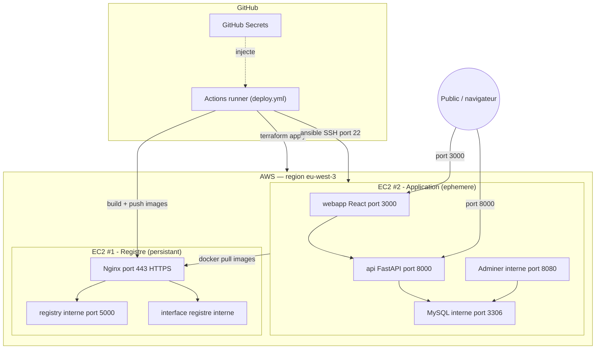

# Diagramme de composants / déploiement — Zero-Touch — où tourne quoi

> **Feature** : architecture cible (issues #3, #4, #5, #7, #16).
> **Sujet** : §2 (Architecture Cible), §6 (infra globale).

## Context

Ce diagramme montre la **structure physique** : les deux serveurs AWS, les services qui y
tournent, et **quels ports** sont exposés à qui. Il répond à « où est quoi ? », pas à
« qui veut quoi ? » (ça, c'est le diagramme 01).

Convention de lecture : un trait **plein** = appel réseau ; un trait **pointillé** = injection
de configuration. Les ports marqués « interne » ne sont **pas** exposés à internet.

## Diagram

## Notes

- **« Frontend et API publics, le reste non »** (sujet §2) : seuls **3000** (front) et **8000**
  (api) sont ouverts au public sur l'EC2 #2. **Adminer (8080)** et **MySQL (3306)** restent
  **internes** — c'est ce que reflète le Security Group de `infra/main.tf`.
- **Le registre n'expose que le 443** : `registry` (5000) et l'interface ne sont jamais
  exposés directement ; Nginx fait le **gardien** (reverse proxy + SSL).
- **L'EC2 #2 est éphémère** : recréée à chaque déploiement (tfstate local au runner). L'EC2 #1
  est persistante (elle garde les images).
- Le runner GitHub touche aux deux serveurs : il **pousse** vers le registre et **configure**
  l'app via Ansible.
