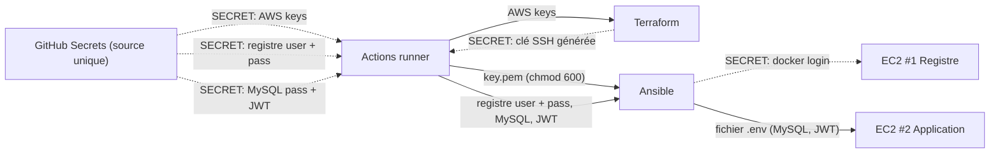

# Diagramme de flux de données — Zero-Touch — circulation des secrets

> **Feature** : gestion des secrets (issues #2, #15, #18).
> **Sujet** : §4.1 (Secret Management), §6 (sécurité stricte).

## Context

Ce diagramme suit **les secrets** depuis leur unique source (GitHub Secrets) jusqu'à leur
consommation, pour prouver qu'**aucun n'est codé en dur**. Chaque flèche portant un secret
est annotée `SECRET: …` — règle de revue : un secret non annoté est un oubli.

La clé SSH est un cas particulier : elle n'existe pas au départ, elle est **générée par
Terraform** puis renvoyée au runner (output), qui l'écrit dans `key.pem`.

## Diagram

## Notes

- **Source unique = GitHub Secrets** : aucun secret n'est dans le code, le `.env.sample` ne
  contient que des placeholders (vérifié par `gitleaks`, issue #15).
- **La clé SSH n'est jamais stockée dans le dépôt** : Terraform la génère à la volée
  (`tls_private_key`), la renvoie en *output sensitive*, le runner l'écrit en `key.pem` (chmod
  600) juste pour Ansible, puis l'infra éphémère disparaît.
- **`chmod 600` obligatoire** : Ansible refuse une clé privée aux permissions trop ouvertes.
- Les noms de secrets sont **figés une seule fois** dans l'issue #2 (contrat d'interface), pour
  que `.env.sample` (#18), le workflow (#10-#14) et le playbook (#9) parlent le même langage.
